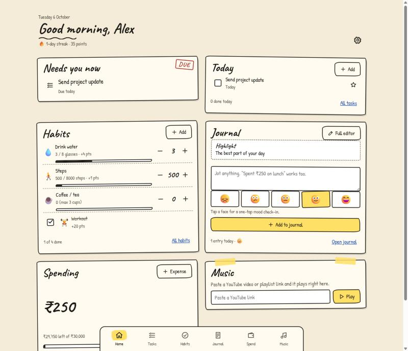
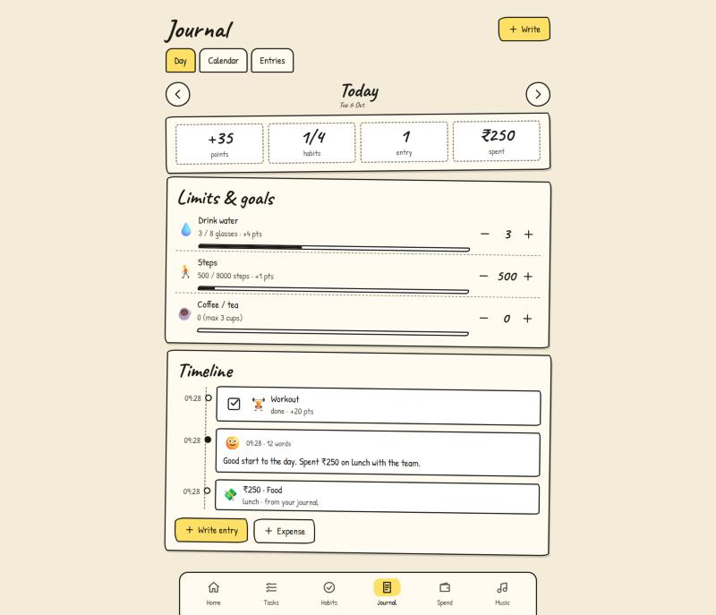
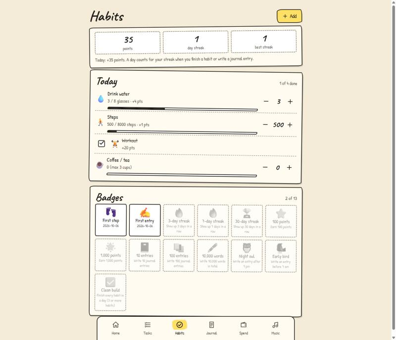

# Day Hub

**One page for your day:** tasks, habits with points and streaks, a journal with a daily timeline, an expense tracker and a YouTube music player, in a cream-paper, hand-written style.

> **No server, no database, no account.** Day Hub is a static web page. Everything you enter stays in *your browser, on your device* and is never uploaded. A strict Content-Security-Policy (`connect-src 'none'`) means the browser itself blocks the page from sending data anywhere.

**Live site:** <https://everything-bele-x.vercel.app>

<p align="center">
  
</p>

<table>
  <tr>
    <td align="center"><br><sub>Journal: one day as a timeline</sub></td>
    <td align="center"><br><sub>Habits: points, streaks and badges</sub></td>
  </tr>
</table>

<sub>Screenshots show sample data.</sub>

- [Quick start](#quick-start)
- [Features](#features)
- [How Day Hub decides things](#how-day-hub-decides-things)
- [Your data](#your-data)
- [Deploy to Vercel](#deploy-to-vercel)
- [Development](#development)

## Quick start

Requires **Node 20+** to serve the files. There is nothing to install.

```bash
npm start        # same as: node server.js
```

Open <http://127.0.0.1:3000>. A four-step setup asks for your name, currency and monthly budget, a few starter habits and an optional YouTube link. You can skip it.

| Setting | How |
| --- | --- |
| Different port | `PORT=3001 npm start` |
| Reach it from your phone (same Wi-Fi) | `HOST=0.0.0.0 npm start`, then open `http://<your-computer-ip>:3000` |

`server.js` only hands the files in `public/` to the browser. It never sees your data, and any static host works the same way.

**On a phone:** open the hosted site and use "Add to Home Screen". Each device keeps its own data; to move it, download a backup on one and use **Restore from backup** on the other.

## Features

| | |
| --- | --- |
| **Home** | Tiles for "Needs you now", today's tasks and habits, a quick journal note with mood, this month's spending against budget, and the music player. Two columns on wide screens. |
| **Tasks** | Due dates, a star for priority, grouped as Overdue / Today / Upcoming / No date, undo after delete. |
| **Habits** | Three kinds: **Daily check** (done or not), **Goal** (count up to a target, e.g. 8 glasses) and **Limit** (stay under a number, e.g. 3 coffees). Pick the weekdays each repeats on and an optional reminder time. |
| **Points and badges** | Checks and goals earn points; a limit earns them while you're under it and **costs** them when you go over. 13 badges, from "First step" to "30-day streak", "Night owl" and "Clean build". Deleting a habit hides it but keeps its points and streak. |
| **Journal** | Several entries a day, free write or one of five rotating prompts, a 5-point mood, tags and word counts. A mood-only check-in is a valid entry. Line breaks are kept. |
| **Daily timeline** | One day top to bottom: journal entries, ticked habits, spending and finished tasks, each with the time it happened. Habits with a reminder show as dashed "planned" rows you can tick in place. Step between days, add entries for past days, or open a day from the Calendar tab. |
| **Spending** | Any currency (₹ by default), 7 categories, month-by-month view, category bars, CSV export. |
| **Expenses from the journal** | While you type "spent ₹250 on lunch", Day Hub offers it as a ticked box. Nothing is added without your tick. |
| **Music** | Paste a YouTube video or playlist link on Home and it plays at once. Saved links are listed, and playback continues as you switch tabs inside the app. |
| **Reminders** | A daily journal reminder and a time per habit, shown in the app and, if you allow it, as system notifications. A web page can't wake itself, so they only fire while Day Hub is open in a tab or window. |
| **Backup** | Full JSON backup, all-expenses CSV, and a Markdown export of your stats, habits, badges and journal. Made on your device and handed to the browser's download. |

## How Day Hub decides things

<details>
<summary><strong>Streaks and points</strong></summary>

- A day counts toward your streak when you make progress on a habit or write a journal entry (the first entry of a day is worth 10 points). Going *over* a limit is not activity.
- Today never breaks a streak while it is still going.
- A day on which none of your habits is scheduled is a rest day: it neither adds to the streak nor breaks it.
- You cannot log a habit or write an entry for a day that has not happened yet.
- **Clean build** needs 3 or more habits finished in a day, at least two of them real check-ins or goals rather than untouched limits.

</details>

<details>
<summary><strong>"Needs you now" on Home</strong></summary>

At most four items, most urgent first:

1. Overdue tasks (longer overdue ranks higher) and tasks due today, starred ones ahead.
2. Habits whose reminder time has passed without being done.
3. A nudge to write the day's entry after your journal reminder time (8 pm if unset).
4. A warning once you pass the month's budget.

Time-based items depend on the page's clock, so they refresh when you return to the tab.

</details>

<details>
<summary><strong>Spending pace and expense detection</strong></summary>

- With a budget set, Home and Spending show roughly how much you can spend per day for the rest of the month. From day 5, a warning appears if the month is on course to end over budget.
- Detection ignores income and budgets ("earned ₹5000", "got paid", "refund", "budget ₹30000"), understands `k`, `lakh` and `crore`, and reads "yesterday", "N days ago" and "on Friday" relative to the entry's day.
- It learns categories from your own history: a word you have filed under the same category twice overrides the built-in word list.
- Editing an entry doesn't re-suggest spending already saved with it, and moving the entry's day or time moves its linked spending too.

</details>

<details>
<summary><strong>Timeline times and quick mood</strong></summary>

- Something done now gets the current time. Something added to a past day gets no time unless you type one, rather than a made-up one. Untimed items sit at the bottom of their day with a "·".
- Within the same minute, the order is habits, tasks, the journal entry, then its spending.
- Rows are grouped under Morning, Afternoon, Evening, Night and Late night.
- Tapping a mood face within 30 minutes of the last quick tap corrects that check-in instead of adding another.

</details>

## Your data

Having no server has trade-offs worth knowing:

- **Per device.** Each browser profile has its own Day Hub. Two devices, two browsers or a private window share nothing. Restore *replaces* what is on that device, and asks first.
- **Clearing site data deletes it.** Download a backup now and then (Settings → Your data → Backup (JSON)).
- **iPhone / iPad Safari** may clear a site's data after about 7 days without a visit unless it is on the Home Screen. Add it, and keep a backup.
- **Room.** Browsers allow roughly 5 MB per site, which is years of text entries. Settings shows your usage, and a full browser produces a clear error with nothing half-saved.
- **Blocked storage.** Day Hub still works for that visit, shows a warning and forgets everything when the tab closes.
- **Several tabs** of one browser stay in step.
- **Unreadable data.** If saved data is damaged, a recovery screen lets you download it exactly as it was, then Start fresh. The damaged copy is kept under another name, never overwritten.
- **Outside requests** are limited to the Google Fonts stylesheet and the YouTube player while a link is playing. Offline, fonts fall back to a plain face and everything still works.

### Migrating from the file-based version

If you used the earlier version that kept data in `data/dayhub.db` (needs Node 22.13+ for this one step):

```bash
npm run export-old-data     # reads data/dayhub.db, writes dayhub-backup.json
```

Then open Day Hub → Settings → **Restore from backup** and pick `dayhub-backup.json`. The script only reads your database. Backups made by the earlier version's own "Backup (JSON)" button restore the same way.

## Deploy to Vercel

The site is plain static files: no database, storage add-on, environment variables or build.

1. Push this folder to GitHub and import it in Vercel (or run `vercel`).
2. Leave the framework as **Other**. [`vercel.json`](vercel.json) already sets no build, serves `public/` and adds the security headers.
3. Deploy.

Anyone with the URL gets *their own* empty Day Hub; they can't see yours, because yours lives only in your browser. If you previously configured Upstash or `DAYHUB_PASSWORD`, you can remove them: nothing reads them any more.

## Development

```bash
npm test        # node:test, no browser needed
```

53 tests cover validation, YouTube link parsing, habit points and streaks, badges, expense detection, every route (in-process against an in-memory store), the browser store (saving, rollback when full, orphan clean-up, restore, damaged data, the older backup format), the static server and its headers, a guard that nothing in `public/` touches the network or a database, and a check that every `import { name }` between modules exists. The screens themselves were checked separately in Chromium via Playwright, which is not part of `npm test`.

### How it's built

There is still an "API", but it runs inside the page. `createBackend().call(method, url, body)` in [`public/js/core/backend.js`](public/js/core/backend.js) matches a route, runs it against a JSON document in `localStorage` (key `dayhub:data:v1`) and saves only if something changed.

- Every request is all-or-nothing: if saving fails, the change is undone and you get an error.
- Calls are queued one at a time and the document is re-read before each, so tabs can't overwrite each other.
- Money is stored as integer minor units (paise/cents).
- Loads and restores go through a strict reader: a bad file is refused and changes nothing.

### Layout

```
server.js         static file server for public/; reads its headers from vercel.json
vercel.json       static deploy: no build, serve public/, security headers (CSP, nosniff, frame-deny)
public/           index.html, styles.css, manifest, icon
public/js/        the screens: plain ES modules, no build step
public/js/core/   the engine: store.js (data), routes.js (actions), backend.js, router.js,
                  habits.js, commit.js, detect.js, insights.js, prompts.js, music.js, validate.js
docs/screenshots/ images used by this README
scripts/          export-old-data.js (one-time: data/dayhub.db -> backup file)
test/             node:test suites
```
